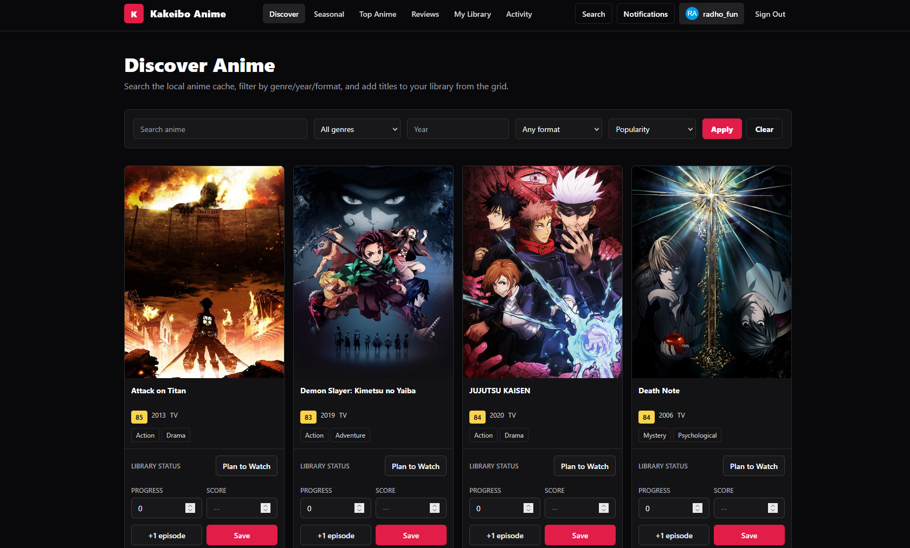
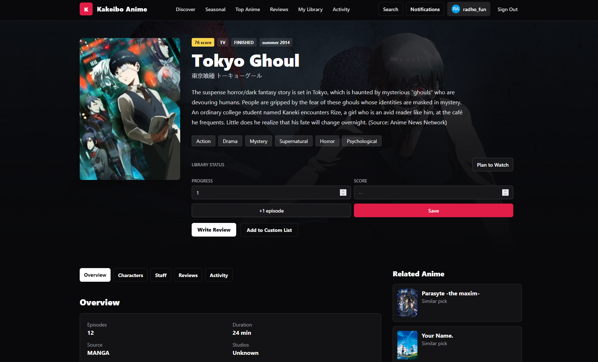
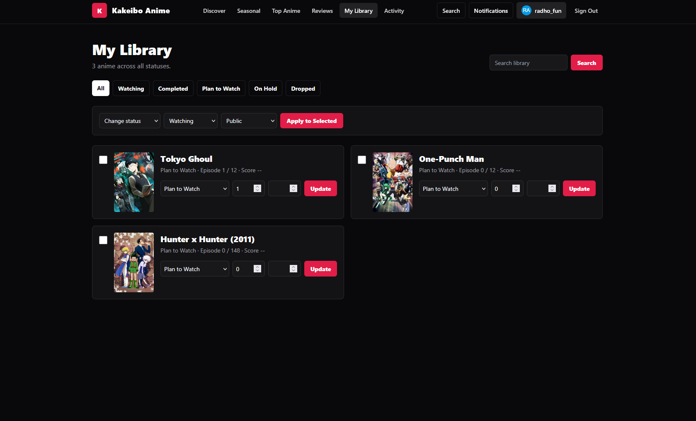

# Kakeibo - AniList Finder

Kakeibo AniList Finder is a social anime watchlist built with Laravel. It lets people discover anime, keep a personal watchlist, record progress, write reviews, and share lists with other viewers.

### Discover anime



### Anime details and reviews



### Personal library



## What You Can Do

- Browse the anime catalog by popularity, score, year, format, and genre.
- Search AniList and cache up to 50 matching anime at a time.
- Keep a personal library with `Watching`, `Completed`, `Planned`, `On Hold`, and `Dropped` statuses.
- Track watched episodes, personal scores, favorites, and library visibility.
- Create spoiler-marked reviews, comments, and likes.
- Build public or private custom anime lists.
- Follow other users, view profiles, and browse activity.
- View seasonal anime and top-anime categories.
- Use admin pages to moderate users, reviews, comments, reports, and cached anime records.

## Discovery Flow

1. Open `/discover` to browse popular anime.
2. When the local catalog needs more titles, Kakeibo fetches a 50-anime batch from AniList and stores it locally.
3. Scroll to the bottom to load the next page automatically. The **Load more anime** button is available if automatic loading cannot run.
4. Use search to find a title. Search results are also cached locally for faster filtering and library use.
5. Open an anime, then add it to your library or write a review.

## Tech Stack

| Layer         | Technology                                            |
| ------------- | ----------------------------------------------------- |
| Framework     | Laravel 12 / PHP 8.2+                                 |
| UI            | Blade, Livewire, Tailwind CSS CDN                     |
| Database      | SQLite for local development; PostgreSQL is supported |
| Anime catalog | AniList GraphQL API                                   |
| Tests         | PHPUnit / Laravel test suite                          |

## Local Setup

```bash
composer install
copy .env.example .env
type nul > database\database.sqlite
php artisan key:generate
php artisan migrate --seed
php artisan serve
```

Open `http://127.0.0.1:8000` after the server starts.

The included demo accounts use this password:

- Member: `demo@kakeibo.test`
- Reviewer: `mira@kakeibo.test`
- Admin: `admin@kakeibo.test`
- Password: `password`

## Database Configuration

The example environment uses SQLite:

```env
DB_CONNECTION=sqlite
DB_DATABASE=database/database.sqlite
```

To use PostgreSQL, set `DB_CONNECTION=pgsql` and provide `DB_HOST`, `DB_PORT`, `DB_DATABASE`, `DB_USERNAME`, and `DB_PASSWORD` in `.env`.

## Main Routes

| Path         | Purpose                                              |
| ------------ | ---------------------------------------------------- |
| `/`          | Landing page with trending and seasonal anime        |
| `/discover`  | Anime catalog, filters, and continuous loading       |
| `/search`    | Anime, user, list, and review search                 |
| `/seasonal`  | Seasonal anime browser                               |
| `/top-anime` | Highest rated, popular, trending, and upcoming anime |
| `/library`   | Signed-in user's watchlist                           |
| `/reviews`   | Community reviews                                    |
| `/lists`     | Signed-in user's custom lists                        |
| `/admin`     | Admin moderation dashboard                           |

## Test

```bash
php artisan test
```
